# ERC-7857 iNFT Standard

## 🎨 **ERC-7857 iNFT Standard: Mermaid Diagrams**

### **Diagram 1: Ideal Oracle Concept (Abstract Flow)**

```mermaid
sequenceDiagram
    participant Sender
    participant Oracle as Ideal Oracle<br/>(TEE or ZKP)
    participant Contract as ERC-7857<br/>Smart Contract
    participant Receiver
    
    Note over Sender,Receiver: Fig.1: Ideal Oracle Abstract Flow
    
    Sender->>Oracle: Query: newDataHash
    
    Note over Oracle: Oracle verifies and responds with:
    
    Oracle-->>Sender: 1. oldDataHash (original encrypted with sender's key)
    Oracle-->>Sender: 2. newDataHash (re-encrypted with new key)
    Oracle-->>Sender: 3. Confirmation: Receiver can access newDataHash
    Oracle-->>Sender: 4. sealedKey (new key encrypted with receiver's pubkey)
    
    Sender->>Contract: transfer(to: Receiver, proof, newDataHash, sealedKey)
    
    Contract->>Contract: Verify Oracle proof
    
    alt Proof Valid
        Contract->>Contract: Update owner: Sender → Receiver
        Contract->>Contract: Update dataHash: oldDataHash → newDataHash
        Contract->>Contract: Publish sealedKey onchain
        Contract-->>Receiver: Transfer complete + sealedKey
        
        Receiver->>Receiver: Decrypt sealedKey with private key
        Receiver->>Receiver: Access metadata using decrypted key
        
        Note over Receiver: ✅ Full ownership + metadata access
    else Proof Invalid
        Contract-->>Sender: ❌ Transfer rejected
    end
```



---

### **Diagram 2: TEE Implementation Flow**

```mermaid
sequenceDiagram
    participant Sender
    participant Storage as 0G Storage<br/>(Decentralized)
    participant TEE as TEE Oracle<br/>(Trusted Execution)
    participant Contract as ERC-7857 Contract
    participant Receiver
    
    Note over Sender,Receiver: Fig.2: TEE-Based Metadata Re-encryption
    
    rect rgb(255, 240, 220)
        Note over Sender,TEE: Step 1: Sender Prepares Data
        Sender->>Sender: Encrypt metadata with oldKey
        Sender->>Storage: Upload encrypted metadata (oldDataHash)
        Sender->>Sender: Encrypt oldKey with TEE's public key
    end
    
    rect rgb(220, 240, 255)
        Note over Sender,TEE: Step 2: Send to TEE
        Sender->>TEE: Send: oldDataHash, encrypted oldKey, receiver's pubkey
        
        TEE->>TEE: Decrypt oldKey with TEE's private key
        TEE->>Storage: Fetch encrypted metadata (oldDataHash)
        TEE->>TEE: Decrypt metadata with oldKey
    end
    
    rect rgb(240, 255, 240)
        Note over TEE: Step 3: TEE Generates New Key
        TEE->>TEE: Generate newKey (securely, sender can't access)
        TEE->>TEE: Re-encrypt metadata with newKey → newDataHash
        TEE->>TEE: Encrypt newKey with receiver's pubkey → sealedKey
    end
    
    rect rgb(255, 255, 220)
        Note over TEE,Storage: Step 4: TEE Outputs
        TEE->>Storage: Store new encrypted metadata (newDataHash)
        TEE-->>Sender: Return: oldDataHash, newDataHash, sealedKey, signature
    end
    
    Note over Sender: Sender now has proof to transfer NFT
```



---

### **Diagram 3: ZKP Implementation Flow**

```mermaid
sequenceDiagram
    participant Sender
    participant Storage as 0G Storage
    participant ZKP as ZKP Oracle<br/>(Zero-Knowledge Proof)
    participant Contract as ERC-7857 Contract
    participant Receiver
    
    Note over Sender,Receiver: Fig.3: ZKP-Based Metadata Re-encryption
    
    rect rgb(255, 240, 220)
        Note over Sender: Step 1: Sender Generates New Key
        Sender->>Sender: Generate newKey (⚠️ Sender knows this key)
        Sender->>Sender: Decrypt metadata with oldKey
        Sender->>Sender: Re-encrypt metadata with newKey → newDataHash
        Sender->>Sender: Encrypt newKey with receiver's pubkey → sealedKey
    end
    
    rect rgb(220, 240, 255)
        Note over Sender,ZKP: Step 2: Sender Sends to ZKP
        Sender->>ZKP: Send: oldDataHash, newDataHash, oldKey, newKey
        
        ZKP->>ZKP: Verify: newDataHash = Encrypt(Decrypt(oldDataHash, oldKey), newKey)
        ZKP->>ZKP: Generate zero-knowledge proof of correctness
    end
    
    rect rgb(240, 255, 240)
        Note over ZKP: Step 3: ZKP Proof Generation
        ZKP-->>Sender: Return: ZK proof (no keys revealed)
    end
    
    rect rgb(255, 220, 220)
        Note over Sender,Receiver: ⚠️ Key Difference from TEE
        Note right of Sender: Sender knows newKey!<br/>Receiver should change<br/>key on next update
    end
    
    Note over Sender: Sender has proof but retains key access
```



---

### **Diagram 4: Complete Transfer Flow (Full Process)**


---

### **Diagram 5: Token Operations Overview**

```mermaid
graph TB
    subgraph Operations["ERC-7857 Operations"]
        Transfer[Transfer<br/>Full ownership + metadata]
        Clone[Clone<br/>Copy metadata, new token]
        Authorize[Authorize Usage<br/>Limited access, no ownership]
    end
    
    subgraph TransferFlow["Transfer Operation"]
        T1[Owner A<br/>dataHash₁]
        T2[Re-encryption<br/>TEE/ZKP]
        T3[Owner B<br/>dataHash₂]
        
        T1 --> T2
        T2 --> T3
    end
    
    subgraph CloneFlow["Clone Operation"]
        C1[Original Token #1<br/>Owner A<br/>dataHash₁]
        C2[Clone Process<br/>Same metadata]
        C3[New Token #2<br/>Owner A<br/>dataHash₁']
        
        C1 --> C2
        C2 --> C3
    end
    
    subgraph AuthorizeFlow["Authorize Usage"]
        A1[Token Owner<br/>Full access]
        A2[Authorization<br/>Sealed Executor]
        A3[Authorized User<br/>Usage only, no data access]
        
        A1 --> A2
        A2 --> A3
    end
    
    Transfer --> TransferFlow
    Clone --> CloneFlow
    Authorize --> AuthorizeFlow
    
    style Transfer fill:#ffe6cc
    style Clone fill:#cce6ff
    style Authorize fill:#e6ffe6
```



---

### **Diagram 6: Smart Contract Architecture**


---

### **Diagram 7: Data Flow Architecture**

```mermaid
graph LR
    subgraph Onchain["Onchain (0G Chain)"]
        Contract[ERC-7857 Contract]
        Registry[Token Registry<br/>tokenId → owner<br/>tokenId → dataHash<br/>tokenId → sealedKey]
    end
    
    subgraph Offchain["Off-Chain"]
        Metadata[Encrypted Metadata<br/>0G Storage]
        Oracle[Oracle<br/>TEE or ZKP]
    end
    
    subgraph User["User Domain"]
        Owner[Token Owner]
        Keys[Private Keys<br/>Public Keys]
    end
    
    Owner -->|owns| Contract
    Contract -->|stores| Registry
    Registry -->|references| Metadata
    Owner -->|interacts| Oracle
    Oracle -->|generates proof| Contract
    Oracle -->|re-encrypts| Metadata
    Keys -->|decrypt| Metadata
    Contract -->|publishes| Keys
    
    style Onchain fill:#ffe6cc
    style Offchain fill:#cce6ff
    style User fill:#e6ffe6
```



---

### **Diagram 8: TEE vs ZKP Comparison**

```mermaid
graph TB
    subgraph Comparison["TEE vs ZKP Approaches"]
        direction LR
        
        subgraph TEE["TEE Implementation"]
            TEE1[🔒 Secure Key Generation]
            TEE2[Sender CAN'T access newKey]
            TEE3[Hardware-based security]
            TEE4[✅ Maximum security]
            TEE5[❌ Requires TEE hardware]
            
            TEE1 --> TEE2 --> TEE3 --> TEE4
            TEE3 --> TEE5
        end
        
        subgraph ZKP["ZKP Implementation"]
            ZKP1[🔓 Sender generates newKey]
            ZKP2[Sender CAN access newKey]
            ZKP3[Software-based proof]
            ZKP4[⚠️ Receiver should rotate key]
            ZKP5[✅ No special hardware needed]
            
            ZKP1 --> ZKP2 --> ZKP3 --> ZKP4
            ZKP3 --> ZKP5
        end
    end
    
    style TEE fill:#e6ffe6
    style ZKP fill:#fff4e6
```



---

## 🎯 **Key Concepts Summary**

### **What ERC-7857 Solves**

```
Problem: Traditional NFTs can't securely transfer AI agent metadata
Solution: Encrypted metadata + verifiable re-encryption + onchain proof

Components:
1. Encrypted Metadata (off-chain on 0G Storage)
2. dataHash (onchain reference)
3. sealedKey (encrypted key for owner)
4. Oracle (TEE/ZKP for re-encryption proofs)
5. Smart Contract (verifies and manages ownership)
```

### **Three Core Operations**

```
Transfer: Full ownership + metadata access transferred
Clone: Copy metadata to new token (same owner or new)
Authorize: Grant usage rights (no data access)
```

### **Security Model**

```
- Metadata always encrypted
- Only owner has decryption key
- Re-encryption uses TEE or ZKP for verification
- Onchain proof ensures correctness
- Receiver confirms before transfer completes
```

These diagrams should give your MCP full understanding of the iNFT standard architecture! Want me to create any additional diagrams for specific aspects?

Sources:
- [GitHub - 0gfoundation/0g-agent-nft](https://github.com/0gfoundation/0g-agent-nft)
- [https://raw.githubusercontent.com/0gfoundation/0g-agent-nft/main/README.md](https://raw.githubusercontent.com/0gfoundation/0g-agent-nft/main/README.md)
- [0G Introducing ERC-7857 | 0G](https://0g.ai/blog/0g-introducing-erc-7857)
- [Deploy your INFT AI Agent to 0G Chain on the new ERC-7857 standard, and upload it to 0G Storage and mint it to the wallet. | by Mioku (Sergio) | Medium](https://medium.com/@intriiga/deploy-your-inft-ai-agent-to-0g-chain-on-the-new-erc-7857-standard-and-upload-it-to-0g-storage-and-176a482f12d2)
- [ERC-7857: Intelligent NFTs for AI Agents](https://blog.thirdweb.com/erc-7857-intelligent-nfts-for-ai-agents/)
- [GitHub - 0glabs/0g-agent-nft](https://github.com/0glabs/0g-agent-nft)
- [Transforming AI Agents into 'Intelligent NFTs': 0G Labs Introduces ERC-7857 Standard | NFT News Today](https://nftnewstoday.com/2025/01/28/transforming-ai-agents-intelligent-nfts-0g-labs-erc-7857-standard)
- [ERC-7857: An NFT Standard for AI Agents with Private Metadata - ERCs - Fellowship of Ethereum Magicians](https://ethereum-magicians.org/t/erc-7857-an-nft-standard-for-ai-agents-with-private-metadata/22391)
- [What is ERC-7857? A New Standard for Intelligent NFTs](https://nftplazas.com/what-is-erc-7857-a-new-standard-for-intelligent-nfts/)
- [feat: add ntf-starter and nft-generator · Issue #2282 · elizaOS/eliza](https://github.com/elizaOS/eliza/issues/2282)
- [0G Labs Announces ERC-7857 and Intelligent NFT (iNFT) ...](https://hub.0g.ai/content/intelligence/679c4fb6fdf2b8a40e773037)
- [ERC-7857: AI Agents NFT with Private Metadata](https://eips.ethereum.org/EIPS/eip-7857)