## 🎯 **0G Serving Broker Flow - Mermaid Diagram**

Here's a comprehensive Mermaid diagram visualizing the 0G Compute/Serving Broker system:


---

## 🔄 **Alternative: Flowchart Style**

```mermaid
flowchart TD
    Start([Start]) --> Step1
    
    subgraph OnChain[" On-Chain (Smart Contract) "]
        Step1[Step 1: Provider registers<br/>verifiable services<br/>Type, Price, URL]
        Step2[Step 2: User pre-deposits<br/>fee to contract]
        Step5[Step 5: Provider submits<br/>ZK-proof for settlement]
        
        subgraph Settlement[" Settlement Process "]
            Parse[Parse ZK-proof]
            Verify[Verify signature]
            CheckNonce[Check nonce]
            CheckBalance[Check user balance]
            Transfer[Transfer funds:<br/>User → Provider]
            
            Parse --> Verify --> CheckNonce --> CheckBalance --> Transfer
        end
        
        Step5 --> Settlement
    end
    
    subgraph OffChain[" Off-Chain (Provider) "]
        Step3[Step 3: User sends request<br/>with signed metadata]
        Store[Provider stores<br/>request data]
        Step4[Step 4: Provider validates<br/>& responds]
        ZKProof[Provider generates<br/>ZK-proof]
        
        Step3 --> Store
        Store --> Step4
        Step4 --> ZKProof
    end
    
    subgraph UserSide[" User/Developer "]
        CreateReq[Create request with:<br/>- Metadata<br/>- Signature<br/>- Nonce]
        VerifyResp[Verify response]
        Decision{Response<br/>valid?}
        
        CreateReq --> Step3
        Step4 --> VerifyResp
        VerifyResp --> Decision
        Decision -->|Yes| Continue[Continue using service]
        Decision -->|No| Stop[Stop sending requests]
    end
    
    Step1 --> Step2
    Step2 --> CreateReq
    ZKProof --> Step5
    
    style OnChain fill:#ffe6cc
    style OffChain fill:#cce6ff
    style UserSide fill:#e6f3ff
    style Settlement fill:#ffcccc
```



---

## 🏗️ **System Architecture Diagram**

```mermaid
graph TB
    subgraph OnChain["🔗 On-Chain (0G Chain)"]
        SC[Smart Contract]
        Services[(Services Registry<br/>- Type<br/>- Price<br/>- URL)]
        Accounts[(User Accounts<br/>- Address<br/>- Balance)]
        Settlement[Settlement Module<br/>- Parse ZK-proof<br/>- Verify signature<br/>- Check nonce<br/>- Transfer funds]
        
        SC --> Services
        SC --> Accounts
        SC --> Settlement
    end
    
    subgraph OffChain["☁️ Off-Chain (Provider Infrastructure)"]
        Provider[Service Provider]
        ZKGen[ZK-Proof Generator<br/>- Request trace<br/>- Metadata<br/>- Signature]
        DB[(Provider Storage<br/>Request History)]
        Validator[Request Validator<br/>- Balance check<br/>- Validity check<br/>- Signature verify]
        
        Provider --> ZKGen
        Provider --> DB
        Provider --> Validator
    end
    
    subgraph UserLayer["👤 User/Developer Layer"]
        User[User]
        ReqBuilder[Request Builder<br/>- Metadata<br/>- Signature<br/>- Nonce]
        RespVerifier[Response Verifier]
        
        User --> ReqBuilder
        User --> RespVerifier
    end
    
    %% Flows
    Provider -->|1. Register services| SC
    User -->|2. Pre-deposit fee| SC
    ReqBuilder -->|3. Signed request| Provider
    Validator -->|4. Validate & respond| RespVerifier
    ZKGen -->|5. Submit ZK-proof| Settlement
    Settlement -->|Transfer| Accounts
    
    style OnChain fill:#fff4e6
    style OffChain fill:#e6f3ff
    style UserLayer fill:#f0f9ff
```



---

## 📊 **State Transition Diagram**


---

## 🔄 **Detailed Sequence with Data Flow**

```mermaid
sequenceDiagram
    autonumber
    
    actor User as 👤 User
    participant Contract as 📜 Smart Contract
    participant Provider as 🖥️ Provider
    participant Storage as 💾 Storage
    
    Note over User,Storage: 🔧 Setup Phase
    
    Provider->>Contract: registerService(type, price, url)
    activate Contract
    Contract->>Contract: Store in Services Registry
    deactivate Contract
    
    User->>Contract: deposit(amount)
    activate Contract
    Contract->>Contract: Update User Account Balance
    deactivate Contract
    
    Note over User,Storage: 📨 Request Phase
    
    User->>User: Generate request:<br/>{address, nonce, service_type, params}
    User->>User: Sign with private key
    User->>Provider: HTTP POST /inference<br/>{metadata, signature}
    
    activate Provider
    Provider->>Storage: Store request metadata
    Storage-->>Provider: Stored
    
    Provider->>Provider: Validate:<br/>1. Signature valid?<br/>2. User balance sufficient?<br/>3. Request format correct?
    
    alt Valid Request
        Provider->>Provider: Process inference
        Provider->>User: Return result + billing headers
        deactivate Provider
        
        User->>User: Verify response
        
        alt Response Valid
            Note over User: Continue using service
        else Response Invalid
            Note over User: Stop sending requests
        end
    else Invalid Request
        Provider->>User: Error response
        deactivate Provider
    end
    
    Note over User,Storage: 💰 Settlement Phase
    
    Provider->>Provider: Generate ZK-proof:<br/>{request_trace, user_signature, metadata}
    activate Provider
    Provider->>Contract: submitProof(zkProof)
    deactivate Provider
    
    activate Contract
    Contract->>Contract: Parse ZK-proof
    Contract->>Contract: Verify signature
    Contract->>Contract: Check nonce (prevent replay)
    Contract->>Contract: Check user balance >= cost
    Contract->>Contract: Transfer: User.balance -= cost<br/>Provider.balance += cost
    Contract-->>Provider: Settlement confirmed ✅
    deactivate Contract
```

---

## 🎯 **Component Interaction Diagram**

```mermaid
graph LR
    subgraph User["👤 User/Developer"]
        A[Create Request]
        B[Sign Metadata]
        C[Verify Response]
    end
    
    subgraph Provider["🖥️ Service Provider"]
        D[Receive Request]
        E[Validate Request]
        F[Store Request]
        G[Process Service]
        H[Generate Response]
        I[Create ZK-Proof]
    end
    
    subgraph Contract["📜 Smart Contract"]
        J[Services Registry]
        K[User Accounts]
        L[Settlement Logic]
    end
    
    A --> B
    B -->|3. Signed Request| D
    D --> E
    E --> F
    E --> G
    G --> H
    H -->|4. Response| C
    C -.->|Valid| A
    C -.->|Invalid| Stop([Stop])
    
    H --> I
    I -->|5. ZK-Proof| L
    
    Provider -->|1. Register| J
    User -->|2. Deposit| K
    L --> K
    
    F -.-> Storage[(💾 Storage)]
    
    style User fill:#e1f5ff
    style Provider fill:#fff4e1
    style Contract fill:#ffe1e1
```



---

## 📝 **Best Diagram Choice**

For **documentation**: Use the **Sequence Diagram** (first one) - it clearly shows the 5-step flow.

For **technical presentation**: Use the **System Architecture Diagram** - shows all components.

For **developer onboarding**: Use the **Detailed Sequence with Data Flow** - shows exact interactions.

For **high-level overview**: Use the **Flowchart Style** - easiest to understand.

Which format works best for your use case?